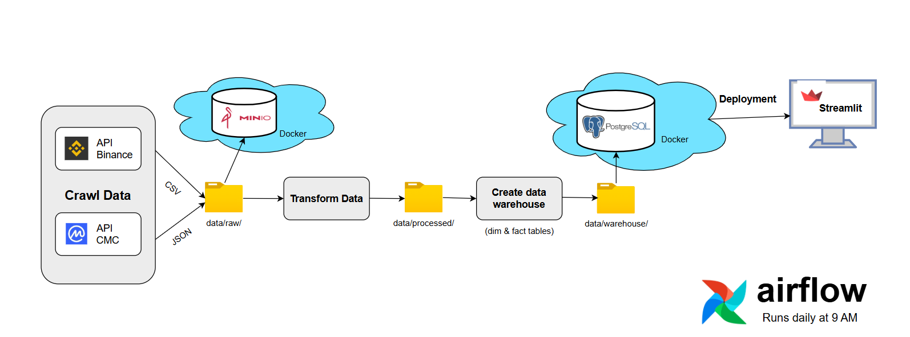

# 💰 CoinAnalytics

## 📌 Giới thiệu
CoinAnalytics là dự án xây dựng hệ thống ETL hoàn chỉnh bao gồm các bước thu thập, xử lý, lưu trữ và phân tích dữ liệu tiền điện tử 
của các trò chơi NFT phổ biến hiện nay từ các sàn giao dịch Binance và CoinMarketCap.



## 🛠️ Công nghệ sử dụng
- **Python** (Pandas, psycopg2, boto3, Streamlit)
- **PostgreSQL** (Lưu trữ dữ liệu)
- **MinIO** (Lưu trữ dữ liệu thô)
- **Apache Airflow** (Quản lý pipeline ETL)
- **Docker** (Triển khai môi trường)

## 📂 Cấu trúc thư mục
```
CoinAnalytics/
│── airflow/                  # Quản lý ETL với Apache Airflow
│   ├── config/
│   ├── dags/
│   ├── data/
│   ├── logs/
│   ├── plugins/
│   ├── .env
│   ├── docker-compose.yaml
│
│── App/                      # Web để hiển thị dữ liệu
│   ├── Pages/
│   │   ├── 1_Price.py         # Trang cập nhập giá token
│   │   ├── 2_Analysis.py      # Trang phân tích sâu
│   │   ├── 3_Info.py          # Trang thông tin về đội ngũ phát triển
│   ├── Home.py
│
│── data/                     # fodler chứa data
│   ├── processed/            # data đã qua xử lý
│   ├── raw/                  # data thô
│   ├── warehouse/            # data dùng để phân tích
│
│── Database/                  # Cấu hình Database
│   ├── Setup_postgres.sql
│
│── src/                       # Pipeline ETL
│   ├── 1_Crawl.ipynb          # Thu thập dữ liệu
│   ├── 2_Transform.ipynb      # Xử lý dữ liệu
│   ├── 3_DB.ipynb             # Tạo các table Dim & Fact
│   ├── 4_Load.ipynb           # Tải dữ liệu lên MinIO & Postgres
```

## 🛠️ Cài đặt
### 1️⃣ Clone dự án
```sh
git clone https://github.com/your_username/CoinAnalytics.git
cd CoinAnalytics
```

### 2️⃣ Tạo môi trường ảo và cài đặt thư viện
```sh
python -m venv .venv
source .venv/bin/activate  # macOS/Linux
.venv\Scripts\activate     # Windows
pip install -r requirements.txt
```

### Chạy lần lượt các file thu thập, xử lý, tạo, và load dữ liệu
```bash
1_Crawl.ipynb
2_Transform.ipynb
3_DB.ipynb
4_Load.ipynb
```


### Truy cập vào Postgres & MinIO để kiểm tra xe data được load vào chứa
```bash

```


### Chạy ứng dụng Streamlit
```sh
streamlit run App/Home.py
```
Truy cập **http://localhost:8501** để xem ứng dụng.


## 📞 Liên hệ
Nếu có thắc mắc, hãy liên hệ với mình qua [tanphatcoder@Gmail.com](mailto:tanphatcoder@Gmail.com).
